# Site Module

## Track your Drupal Site

This is the documentation for Site Module.

Any Drupal site can use it.

## Usage

### Site State widget

At the top right of your site is a "state" indicator. It will say "OK", "Warning", or "Error" depending on the state of your site. 
 
To view the Site Status page, click the widget.

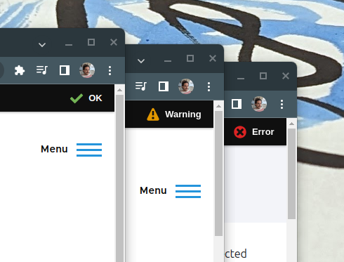

At the top left of the page, you will see a Drupal logo menu. (If not, click 
"Manage" to show the full menu.)

Hover over it to see the "About this site" link. It goes to the same page as the **Site State Widget**.

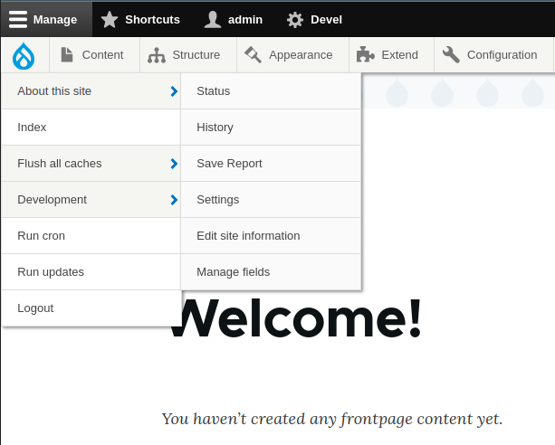

## Site Status / About this Site

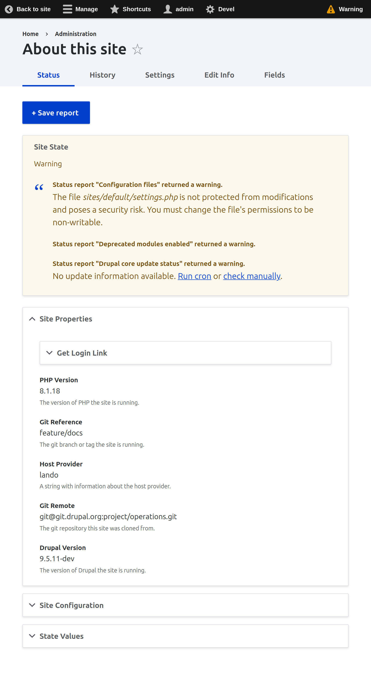

The Site Status page displays the state of your site, the reasons for that state,
properties and configuration. 

This information is saved over time in *Site Reports*. Press the *Save Report* 
button 
saves this information as a snapshot, viewable on the *History* tab.

### Site Information 
#### "Drupal Project" entity

This display is a "Drupal Project" entity. It is the same across all environments of your Drupal website. Use it for fields you wish to make available to all instances of this site.

### Current Environment
#### "Site" Entity

This display is for the "Site" entity, unique to the environment you are running in. When loading this page in a new environment, you will see a "Create Site Record" button instead of this display. Click it to create the site entity with all properties gathered.

### Site State

*Site State* is a single value that represents the overall state of your 
Drupal site OK, WARNING, or ERROR.

The factors that affect state are configurable and other modules can provide 
plugins to affect state.

By default, State is determined by *Drupal Core Status Report*.

[Site Audit](https://www.drupal.org/project/site_audit) module is also 
supported.

### State Reason

*Site State Reason* is a renderable array of information explaining why the
site is in the state it is in.

This information is saved in site reports for later review.

### Site Properties

Site Properties are small bits of information that are attached to your site 
reports, generated by `SiteReport` plugins.

Examples include PHP & Drupal versions & Host Provider. See the
[SitePropery plugins folder](../src/modules/site/src/Plugin/SiteProperty) to
view all current property plugins.

On the Site Status page, the information is generated in real time. When a 
Site Report is saved, they are stored, attached to the Site Entity Revision.

### Site Configuration & State Values

Site Reports will store the selected configuration and state values from 
your site.

Visit **Settings** to configure what config & state items to save in Site 
Reports.

<br clear="both"/>

## Site History

The Site History page displays the "Revisions" of your Site Entity, known 
here as "Site Reports". 

Each site report stores Site State, Reasons, and other properties, along 
with a log message describing how the report got created.

To view a Site Report in detail, click the **Site Title** on the **History** 
page.


## Site History Reports
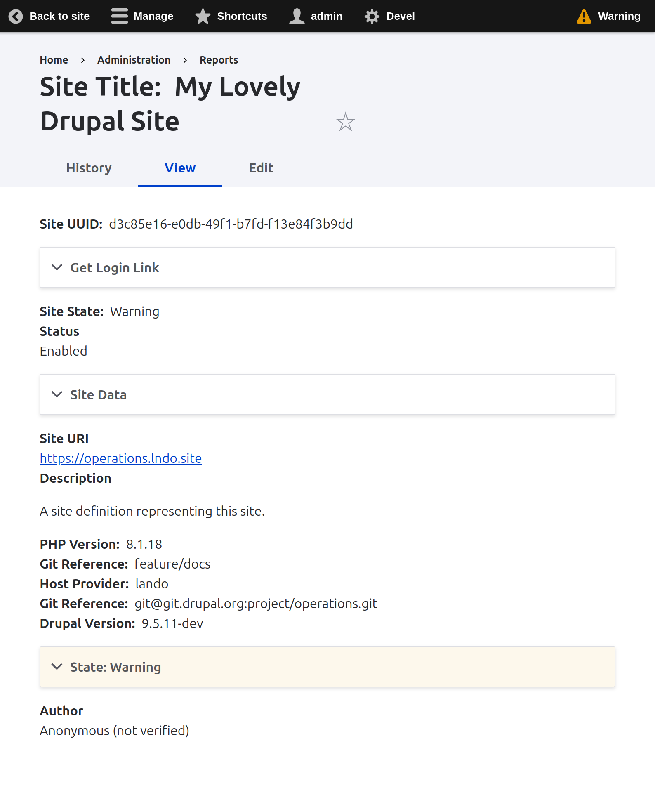

Each entry in the Site History page is a snapshot in time.

Technically, they are `SiteEntity` Revisions, but we call them Reports.

The fields shown on a Site Report are the same kind of data as on the Site 
Status page, but are saved in the report revision.

This allows you to go back in time and review the changes to these 
properties.

### Site Data

The *Site Data* field is a serialized dump of arbitrary data, which includes 
the Drupal configuration and state values chosen in [Site Settings](#site-settings)

### Site State

Just like on the Site Status page, site reports can display the state and 
reason *at the time the report was filed.*

<br clear="both">

## Site Config History

If the "Save on Config Changes" box is checked in Site Settings, then you 
will get a new report saved everytime a Drupal config object is saved.

Additionally, the changes that took place are saved for comparison later.

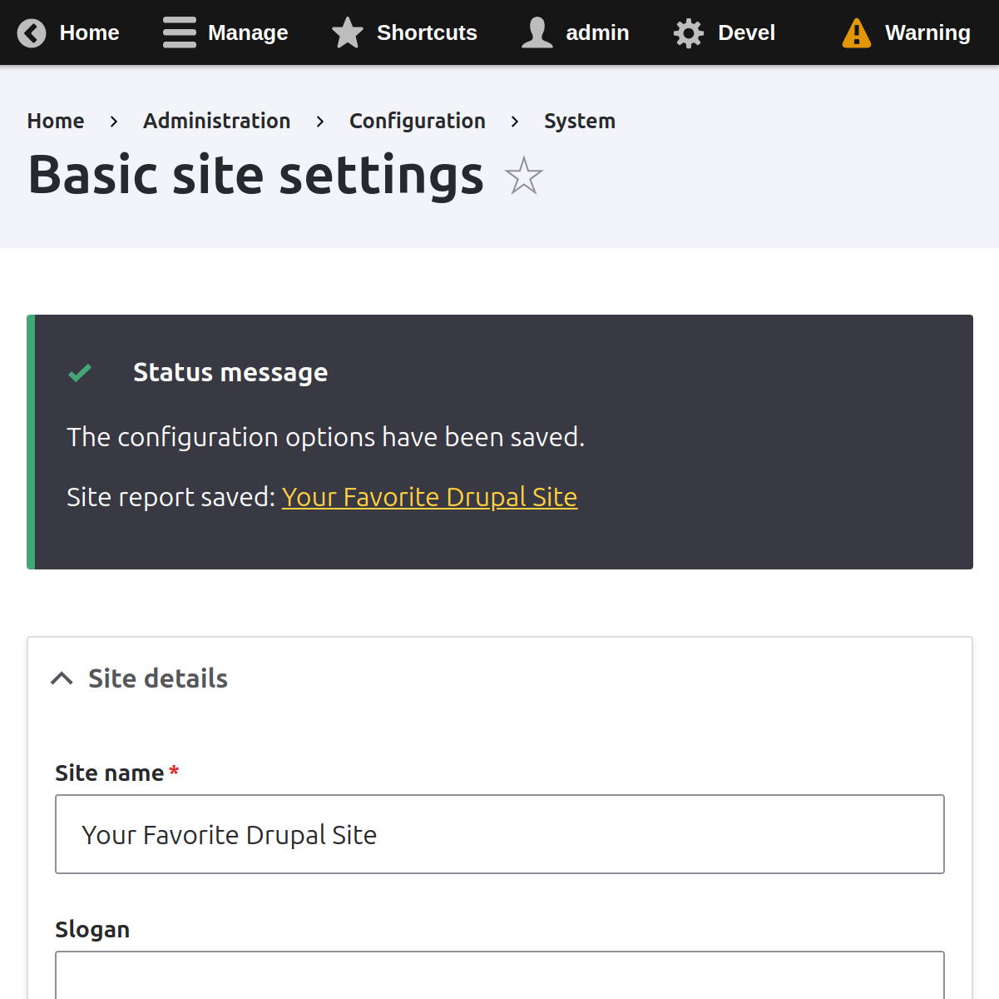
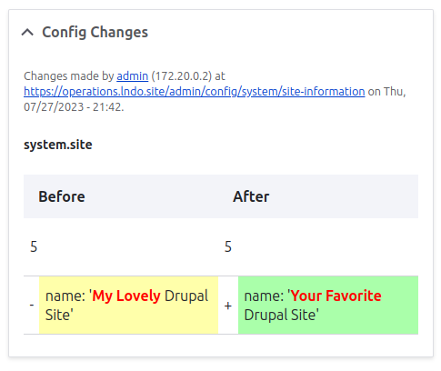

<br  clear="both">

## Site Fields
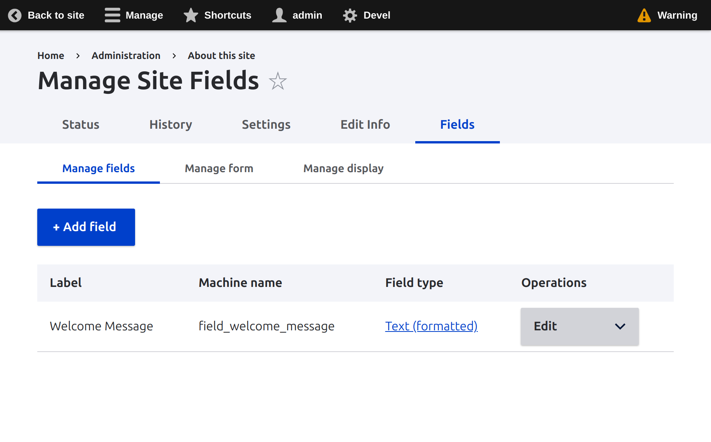

Since the `SiteEntity` is an entity, it is fieldable.

Click "About this site" > "Fields" to configure this site's fields.

In this screenshot, there is an example field called "Welcome Message". 

This makes it possible to store bits of information as fields attached to the 
site, so you don't have to create an additional entity or node type.

With the right permissions, customers could be given edit access to make 
small changes to their site using SiteEntity fields.

<br clear="both">

### Retrieving Site Entity & Drupal Project Fields

Loading the Site Entity or Drupal Project entity to get it's fields is almost the same as any other entity.

Instead of loading it by ID, you can just get the site entity for the 
current site with `SiteEntity::getSelf()` or `DrupalProject::getSelf()`.

For example, to load a field and present a message, you can use this code. 
```php
<?php 
  use \Drupal\site\Entity\DrupalProject;
  
  // Load the entity just like any other, but with loadSelf().
  /** @var DrupalProject $drupal_project */
  $drupal_project = SiteEntity::loadSelf();
  
  // Load the field value just like any field.
  $welcome_message = $drupal_project->get('field_welcome_message')->value;
  
  // Do something with the value.
  \Drupal::messenger()->addStatus($welcome_message);
```

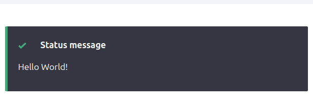

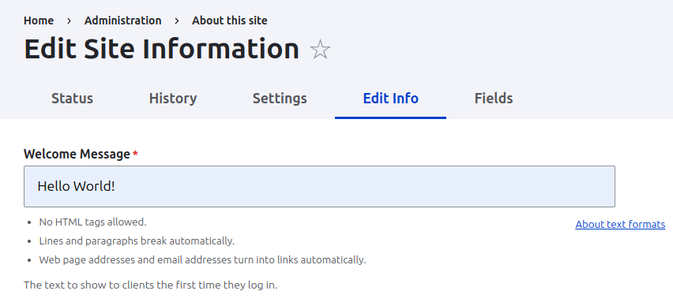


<br clear="both">

### Site vs Project

Remember: anything unique to that environment is saved to `SiteEntity` objects. This means URLs, PHP Version, etc. 

Data that is saved across environments is saved into `DrupalProject` entities. If you wish to use fields for your site with the same entity in every environment, use the `DrupalProject` entity. The only properties included by default are Site UUID, git URL, and Canonical URL.

## Site Settings
The Site Settings page controls how Site Status and Reports are handled.

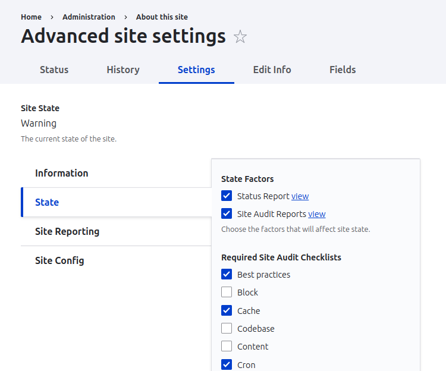

## State

The factors that affect Site State can be configured. Currently supported 
factors are Drupal Core Status report page, and [Site Audit](https://drupal.org/project/site_audit) module.

Choose the factors that make the most sense for your site.
<br clear="both">

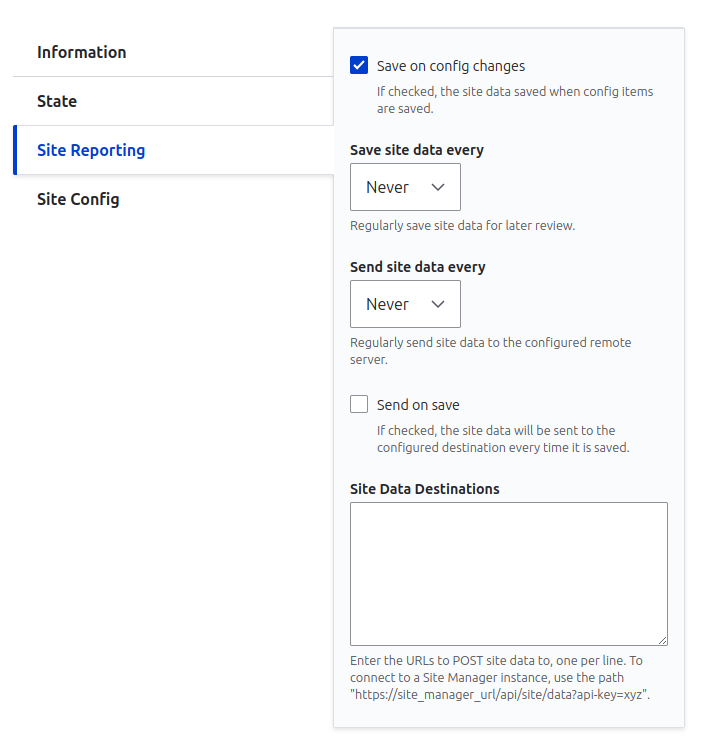

## Site Reporting

Site reports can be generated every time config changes, on cron, or manually.

## Remote Reporting

Site reports can also be *sent* to remote destinations. Select "Send on
Save" or set an interval to "Send site data".

Enter the URLs of any REST endpoints you wish to send the site entity to. *See
[Site Manager](SITE_MANAGER.md)*.

## Site Config

Select the Drupal configuration and state values to save in your site reports.

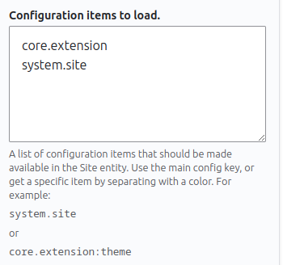
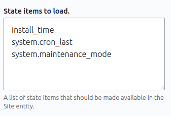

## Architecture

The Site Module takes advantage of Drupal's Entity and Plugin APIs to create
a system for viewing and tracking information about your site.

### Site Entity

A Site Entity is a Content entity with the UUID being the UUID of your site.

That means that every site gets a single Site Entity.

Site Entities are Revisionable, which acts as a historical record. The
module features a "Save Report" button and cronjob that can save Site
Entity Revisions. (a.k.a. "Site Reports").

Site Entities can be saved on Config changes, storing a record of before and
after values.

Site Entities are fieldable which means you can add fields to your Drupal
site and Manage Display and Form just like any other Drupal site.

See [SiteEntity Class](../src/modules/site/src/Entity/SiteEntity.php).

### Site Entity Bundles

Site Entity bundles are for different types of sites. Each bundle type contains the fields that make sense for that type.

1. `SiteEntity`: Top object. All site entities have these fields: hostname, site_uri, state, reason, site_title, data, settings.
2. `DefaultSiteBundle` 
   - `getRemote()` method loads HTTP status and content from site_uri fields.
   - `getPageTitle()` method parses the HTML and loads the <title> field. 
   - 
4. `WebAppBundle` > `PhpSiteBundle`: Placeholders. Could be used in the future for non PHP, non Drupal websites.
4. `DrupalSiteBundle`: 
   - `getRemote()` method accesses SiteAPI to gather data, if it exists.
5. `SiteManagerSiteBundle`: Used to connect to a remote Site Manager instance. Validates the API key works.

`SiteProperty` fields can define what bundles they appear on, allowing fields to attach to different site types depending on what they are.

For example, the PHP Version property is attached to `PhpSiteBundles`, and every bundle that extends it (Such as `DrupalSiteBundle`.)

      /*
      * @SiteProperty(
      *   id = "php_version",
      *   name = "php_version",
      *   label = @Translation("PHP Version"),
      *   site_bundles = {
      *     "Drupal\site\Entity\Bundle\PhpSiteBundle"
      *   },
      *   description = @Translation("The version of PHP the site is running.")
      */

### Drupal Project

A "Drupal Project" entity is stored once per installed Drupal site. The ID of the project is the Drupal Site UUID. This entity gets copied along with your content to other environments. Use it to store field data that needs to be available in all environments.

### Site Properties

The `SiteProperty` Plugin type is a simple class that defines a data point
about the site.

This single class has methods for determining value both for the
`SiteDefinition` entity *and* the `SiteEntity` content entity.

Properties can define first class Entity fields so that the value gets saved
for later use.

See [Plugins\SiteProperty folder](../src/modules/site/src/Plugin/SiteProperty)
in the Site module for examples. 


### Site Actions

The `SiteAction` plugin types provide simple user interface for taking specific actions on sites.

Site Actions get automatically added to the "Operations" widget of site entities. Look for the ^ dropdown button on site entity teasers.

For example, the `UserLogin.php` site action adds a "Sign in" link to this menu:

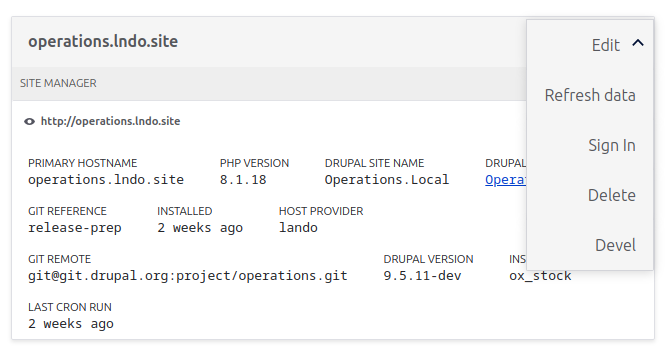

See [Plugins\SiteAction folder](../src/modules/site/src/Plugin/SiteAction)
in the Site module for examples. 

