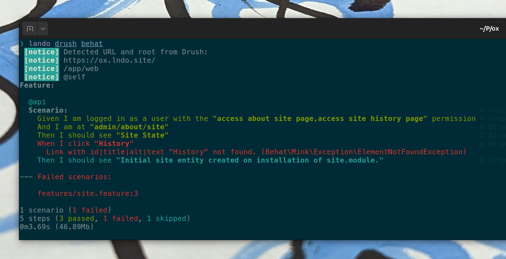

# Drush Behat Params

A basic drush plugin that calls behat with `BEHAT_PARAMS` with URL, root and drush alias set automatically.

## Usage:

1. Install with composer:

       composer require drupal-operations/drush-behat-params`

2. Run with drush

       drush behat
    or

       drush @alias behat

Make sure `DRUSH_OPTIONS_URI` value is set so behat tests the right URL.

NOTE: For easy setting of `DRUSH_OPTIONS_URI` on Lando, see https://github.com/drupal-operations/drupal-settings. 

## What?

Behat uses either hard-coded config or a JSON blob in BEHAT_PARAMS to configure what site to test.

Instead of messing with ENV vars, this plugin sets BEHAT_PARAMS for you using the Drush alias information.

## Development

This tool is a part of the [Drupal Operations / OX project](https://drupal.org/project/ox). The code is maintained in the monorepo "ox".

See https://git.drupalcode.org/project/ox for more information.
